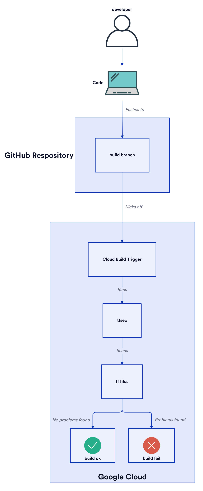
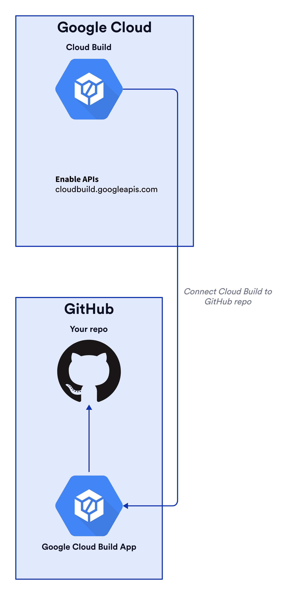
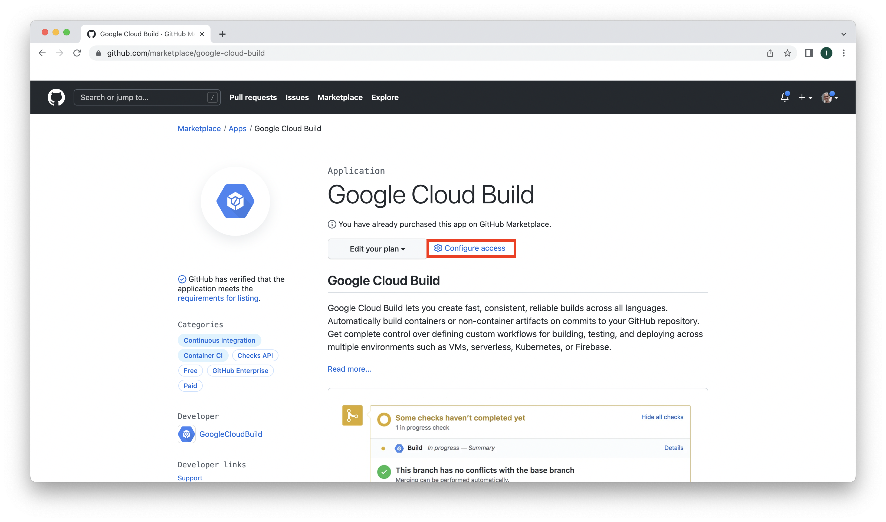
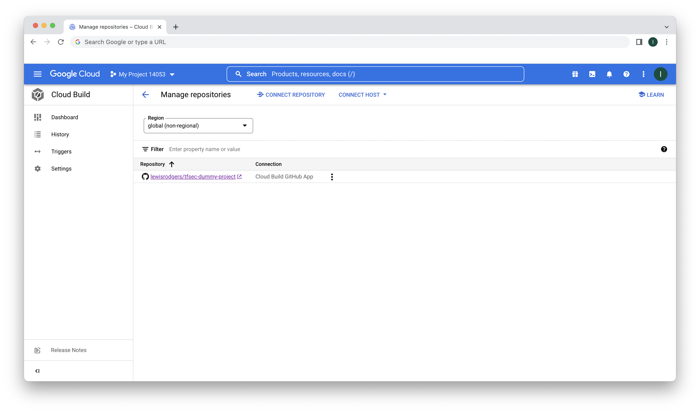
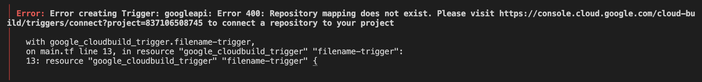
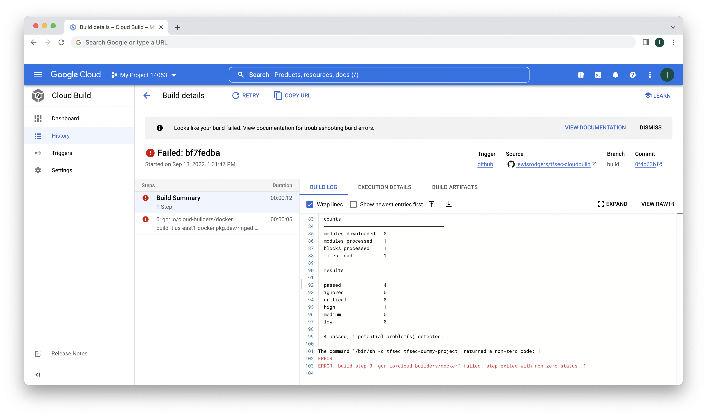

# About

[Tfsec](https://aquasecurity.github.io/tfsec/v0.63.1/) is a command-line tool that scans Terraform files and reports potential configuration problems. Many of the checks tfsec scans for map back to CIS Benchmark recommendations. Adding this scanning tool to our CI pipelines is one way to help us prevent unwanted configurations from getting into production.

We're going to set up a Cloud Build trigger through Terraform. The trigger will be configured to watch the target repo with a branch called _build_. The build process is triggered as code gets pushed to the _build_ branch. As part of the build process, tfsec will scan the code and report back its findings. If tfecs finds a problem, the build will fail.



# Assumptions

- You have experience with Terraform and have it installed.
- You have a GitHub account and have experience with git.
- You have a Google Cloud Platform (GCP) project to deploy infrastructure to.
- You have experience with `gcloud`.

# Clone stuff

Clone the `tfsec-cloud-build` repo that contains the Cloud Build infrastructure. You'll deploy the infrastructure to your own GCP project.

```
git clone https://github.com/lewisrodgers/tfsec-cloud-build
```

Clone the `tfsec-dummy-project` repo.

```
git clone https://github.com/lewisrodgers/tfsec-dummy-project
```

You need the ability to push code to the repo as a way to trigger the build. So, push the repository to your own GitHub account. You'll configure Cloud Build to target the new repo.

# Update some files

We need to reference your GPC project and GitHub account properly. In the `tfsec-cloud-build` repo, open the `terraform.tfvars` file located in the _cloudbuild_ directory and update the values.

```sh
# terraform.tfvars
project      = "YOUR_PROJECT_ID"      # <- Insfrastructure will be deployed here
github_owner = "YOUR_GITHUB_USERNAME" # <- GitHub account you pushed tfsec-dummy-project to
```

In the `tfsec-dummy-project` repo, update `cloudbuild.yaml`. Change the `_USERNAME` subtitution variable to match your GitHub username.

```yaml
# cloudbuild.yaml
steps:
- name: 'gcr.io/cloud-builders/docker'
  args: ['build', '-t', 'us-east1-docker.pkg.dev/$PROJECT_ID/myrepo/tfsec', '--build-arg', 'user_name=${_USERNAME}', '.']
substitutions:
  _USERNAME: 'YOUR_GITHUB_USERNAME' # <- Change me
```

Wait until the end to push these changes back to the _build_ branch.

# Connect services

Before we can run Cloud Build against the dummy repository, we need to enable the `cloudbuild.googleapis.com` API and connect Cloud Build with GitHub.



First, enable the Cloud Build API on your GCP project.

```
gcloud services enable cloudbuild.googleapis.com
```

Now we can connect the services. To do this, go to the [Google Cloud Build app in the GitHub marketplace](https://github.com/marketplace/google-cloud-build) and configure access.



After following the configuration steps for installing the Google Cloud Build app (omitted for brevity), you should see your connected repo in the Cloud Console under Cloud Build > Triggers > Manage repositories.



# Run Terraform

We're ready to deploy some infrastructure. From the _cloudbuild_ directory, initialize and run Terraform to deploy the Cloud Build trigger.

```
cd cloudbuild
terraform init
terraform plan -out tfplan
terraform apply "tfplan"
```

If you get this error...



then, your configuration in `terraform.tfvars` may not be correct. Or, you may not have connected Cloud Build with GitHub.

# Trigger the build

All the pieces are in place. If you haven't already, make a change in the code from the `tfsec-dummy-project` repository. Then, push it to the _build_ branch. The build will fail because tfsec detects a configuration problem. You can view the tfsec report by selecting the most recent build from the list at Cloud Build > History.


